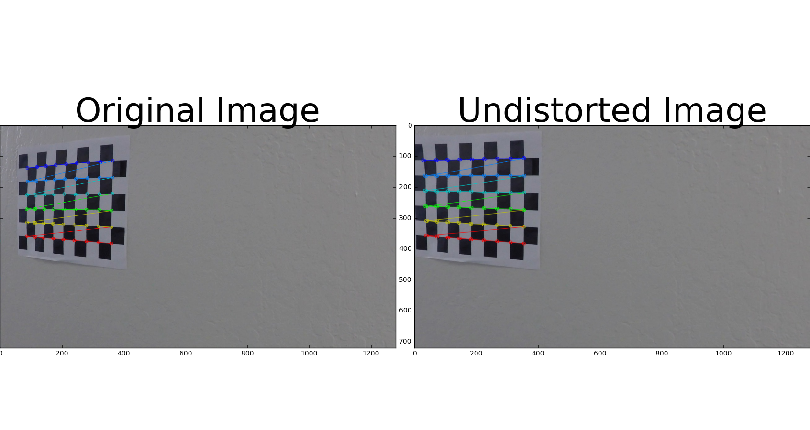
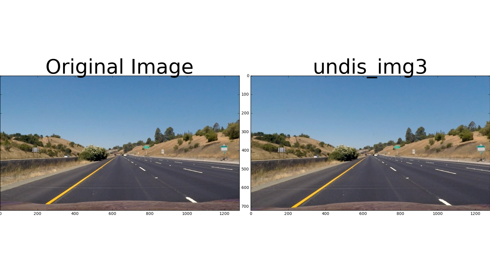
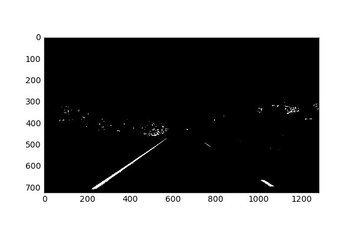
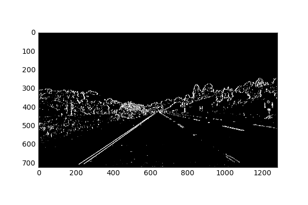
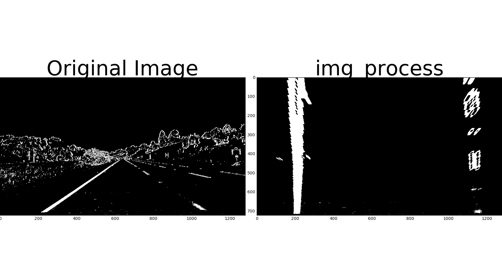
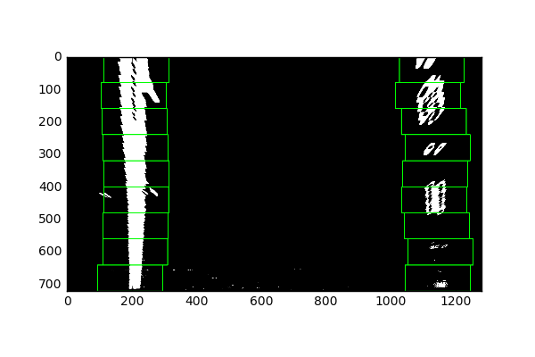
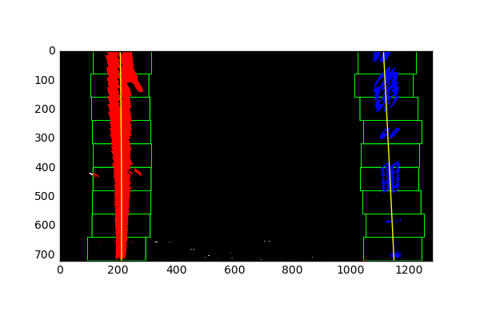
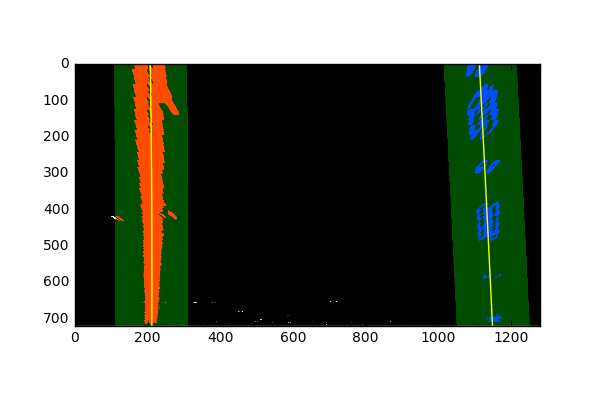
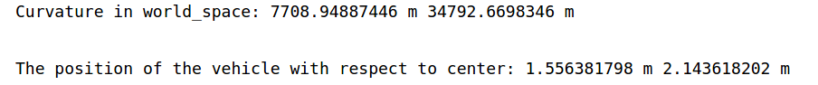
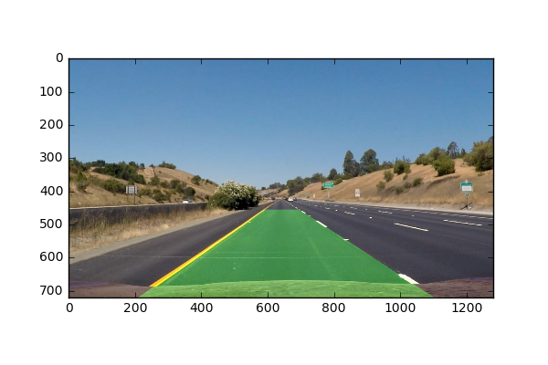

# Writeup_ Advanced Lane Finding Project

### The goals / steps of this project are the following:

---

#### 1. Camera Calibration

The code for this step is contained in the second code cell of the IPython notebook located in "Advance_Lane_detection.ipynb". 

I start by preparing "object points", which will be the (x, y, z) coordinates of the chessboard corners in world coordinate system. Here I am assuming the chessboard is fixed on the (x, y) plane at z=0, such that the object points are the same for each calibration image. Here I define objpoints and imgpoints are 3D and 2D points in real world space and image plane,respectively. I used `cv2.findChessboardCorners()` to find corners of chessboard to get the output --`objpoints` and `imgpoints`  

I then used the output `objpoints` and `imgpoints` to compute the camera calibration and distortion coefficients using the `cv2.calibrateCamera()` function. I applied this distortion correction to the test image using the `cv2.undistort()` function and obtained this result: 

### Pipeline (single images)

#### 1. Provide an example of a distortion-corrected image.

To demonstrate this step, I will describe how I apply the distortion correction to one of the test images like this one:

#### 2. Used color transforms, gradients methods to create a thresholded binary image.  

I used a combination of S channel and gradient thresholds to generate a binary image. Below　is examples of my output for this step.  (note: this is not actually from one of the test images). The code for this step is contained in the fourth code cell of the IPython notebook located in `Advance_Lane_detection.ipynb`. I defined three function contain these three step -- S_binary(), Sobel_edge(), combined_binary().

#### 3. Performed a perspective transform.

The code for this step is contained in the fifth code cell of the IPython notebook located in `Advance_Lane_detection.ipynb`.

The code for my perspective transform includes a function called `persective_T()`. The `persective_T()` function takes as inputs an image (`img`), as well as source (`src`) and destination (`dst`) points. 

#### 4. Identified lane-line pixels and fit their positions with a polynomial.

The code for this step is contained in the sixth code cell of the IPython notebook located in `Advance_Lane_detection.ipynb`.

First, use histogram to find the start point of the window which need to slide later to fine the nonzero point in binary image(IPM image). Use `image.nonzero()` to find the nonzero pixel in image, and then save the x,y value of nonzero pixel in `nonzerox` and `nonzeroy`, use `nonzerox` and `nonzeroy` to update the 9 windows position. The average value of every nonzero point which in the window is the middle point of the window. The nonzero pixel which inside the window is the lane-line pixels.

And then, use `np.polyfit` to fit every lane-line pixels with a polynomial. Fit the left and right line respectively.

Below is the output of the image:

#### 5. Describe how (and identify where in your code) you calculated the radius of curvature of the lane and the position of the vehicle with respect to center.

The code for this step is contained in the seventh code cell of the IPython notebook located in `Advance_Lane_detection.ipynb`.

Curvature: Firstly, I find the relationship between the world space and image space, and compute per pixel in x,y dimension in meters. Fit now polynomials to x, y in world space, and then use function to calculate the now reaii of curvature.

The positon of the vehicle with respect to center: Assume the camera is mounted at the center of the car, such that the lane center is the midpoint at the bottom of the image between the two lines I have detected. The offset of the lane center from the center of the image (converted from pixels to meters) is the distance from the center of the lane.

Below is the result of curvature and vehicle location (vehicle with left and right lane), I use image is from `test_images/straight_lines1.jpg`, this image is not from project video. so the curvature is not 1km.

#### 6.An example image of my result plotted back down onto the road.

The code for this step is contained in the sixth code cell of the IPython notebook located in "Advance_Lane_detection.ipynb". Here is an example of my result on a test image:

---

### Pipeline (video)

#### 1. My final video output.  

`test_videos_output/project_video.mp4`

---

### Discussion

#### 1. Briefly discuss any problems / issues you faced in your implementation of this project.  Where will your pipeline likely fail?  What could you do to make it more robust?

In this work, I use many OpenCV function, for example, ` cv2.findChessboardCorners(), cv2.calibrateCamera(), cv2.addWeighted`. From the vedio, some area still couldn't detect curvature well (A region of great curvature), and detected lines are shaking sometimes. I think it because size of green window box. And In step of perspective transform, I choose `src` and `dst` points by myself, I think this part I will improve later.

